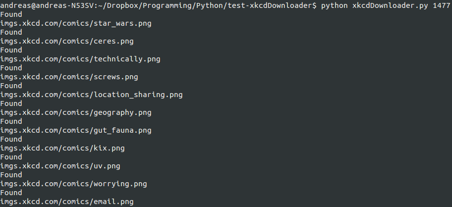

# xkcdDownloader

Who doesn't like xkcd comic strips? I made a little downloading script in Python, that will let you download all of the comics on from the site. I makes use of urllib2 to download the comicstripes.

## How to

Put the script in the same folder you want the comicstripes. E.g. if you want your folders in ~/funny/ you put the script in ~/funny, and run it from there as well.

The script takes one argument, which is the number of the most recent xkcd picture. You can find this number on www.xkcd.com

In the following image, the number is marked with a red box.

This number varies, as there are added more pictures all the time.

Example usage

